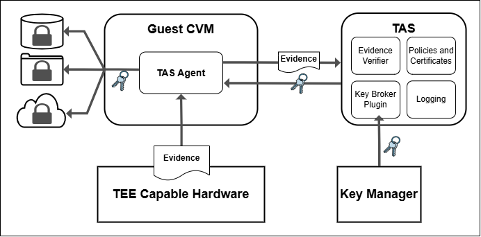

# TEE-Attestation

Home of the Trusted Execution Environment Attestation Service (**TAS**) and tools and libraries for building, securing, attesting and verifying Trusted Execution Environments (TEEs) to enable Confidential Computing.

## TAS Overview

TAS is a simple attestation service that verifies attestation evidence generated by TEEs. The standard deployment for TAS is as a service, to validate incoming evidence from booting confidential virtual machines (CVM), and after successful validation to provide a key to unlock the root file system of the CVM. This same process can be applied to unlocking anything, from access to data stores to identities on encrypted networks. You can also simply use the service to take in, verify, and log CVM attestation evidence at any point in the virtual machine's lifecycle.

TAS provides:
- **TEE Attestation**: Validates AMD SEV-SNP and Intel TDX (soon) attestation evidence
- **Key Management**: Secure key retrieval with cryptographic nonce validation
- **Policy Management**: Store and validate security policies for attestation
- **Pluggable Architecture**: Support for multiple Key Broker Modules (KBM)

### Components

- [**TAS**](https://github.com/TEE-Attestation/tas), a server that verifies attestations, manages policies and orchestrates secret distribution
- [**TAS Agent**](https://github.com/TEE-Attestation/tas_agent), running within your TEE to collect evidence and interact with the TAS API, runnable as a service or from the command line
- **Libraries** to process and verify different attestation types:
    - [**snp_pytools**](https://github.com/TEE-Attestation/snp_pytools) for AMD SEV-SNP
    - [**tdx_pytools**](https://github.com/TEE-Attestation/tdx_pytools) for Intel TDX

## Contributing

Thank you for your interest in contributing to this project and community. Please refer to our [contribution guidelines](https://github.com/TEE-Attestation/tas/blob/main/CONTRIBUTING.md).

## License

This project is licensed under the MIT license. See LICENSE file for details.
